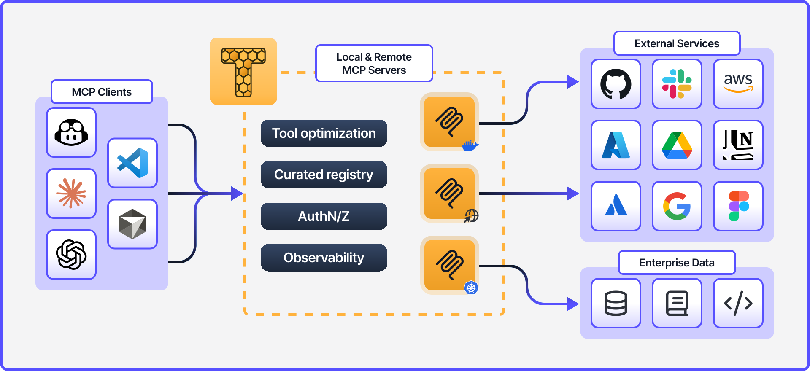

<picture>
  <source media="(prefers-color-scheme: dark)" srcset="./images/stacklok-wordmark-gradient.svg">
  
</picture>

[Website](https://stacklok.com/) | [Blog](https://dev.to/stacklok) | [LinkedIn](https://linkedin.com/company/stacklok)

## MCP servers made simple and secure
 

  <picture>
    <source media="(prefers-color-scheme: dark)" srcset="./images/toolhive-wordmark-white.svg">
    
  </picture>

 
  
[ToolHive](https://toolhive.dev) is the open source MCP platform built and maintained with the community

  <picture>
    <source media="(prefers-color-scheme: dark)" srcset="./images/toolhive-diagram-dark.svg">
    
  </picture>

 
<table align="center">
<tr>
<td width="50%" valign="top">

 
  
**Get Started** 🚀

- [ToolHive overview](https://docs.stacklok.com/toolhive)
- [Watch demo videos](https://www.youtube.com/@stacklok)
- [Quickstarts](https://docs.stacklok.com/toolhive/quickstart)
- [MCP primer](https://docs.stacklok.com/toolhive/concepts/mcp-primer)

**Core Projects** 🛠️

- [toolhive](https://github.com/stacklok/toolhive) – CLI, API, and Kubernetes Operator
- [toolhive-studio](https://github.com/stacklok/toolhive-studio) – Desktop UI
- [toolhive-cloud-ui](https://github.com/stacklok/toolhive-cloud-ui) – Cloud UI
- [toolhive-registry-server](https://github.com/stacklok/toolhive-registry-server) – Registry API

</td>
<td width="50%" valign="top">
 

  **Enterprise Integrations** 🔌

- [AI client support](https://docs.stacklok.com/toolhive/reference/client-compatibility)
- [Custom registry](https://docs.stacklok.com/toolhive/tutorials/custom-registry)
- [Authentication](https://docs.stacklok.com/toolhive/concepts/auth-framework)
- [Observability](https://docs.stacklok.com/toolhive/tutorials/opentelemetry)
- [Secure ingress](https://docs.stacklok.com/toolhive/tutorials/k8s-ingress-ngrok)
- [Secrets management](https://docs.stacklok.com/toolhive/tutorials/vault-integration)

**Community** 👥

- [Discord](https://discord.gg/stacklok) – Join the conversation
- [Contributing](https://docs.stacklok.com/toolhive/contributing) – Help build ToolHive
- [Good first issues](https://github.com/stacklok/toolhive/issues?q=label%3A%22good+first+issue%22+is%3Aissue+is%3Aopen)

 
</td>
</tr>
</table>

<!-- markdownlint-disable-file first-line-heading no-inline-html no-emphasis-as-heading -->
